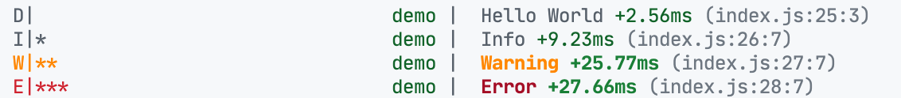

# 🌱 Zeed Library

> [!CAUTION]
> The main repository is now at <https://codeberg.org/holtwick/zeed> to strengthen European sovereignty. Learn more at [UnplugTrump](https://holtwick.de/blog/unplug-trump).

- Strict **TypeScript**
- **Zero dependencies** and lightweight, **tree-shakable**
- **Universal** for browsers, as well as node, deno and bun
- Modern **ESM**, fallback to CommonJS available
- Mostly covered by **tests**

Get started like this:

```sh
npm i zeed
```

Links:

- API docs at https://zeed.holtwick.de/
- Github repo at https://github.com/holtwick/zeed

## Universal Logging

Powerful logging for browser and terminal.

```js
import { Logger } from 'zeed'

const log = Logger('demo')

log('Hello World')
log.info('Info')
log.warn('Warning')
log.error('Error')
```

Sample output on a terminal:



Sample output in Safari:


By default, the most appropriate log handlers are activated. By default, a colorful output is applied for better orientation. Each line has trace info to allow direct jumps back into the code where the log has been issued. Logs can easily be filtered by level.

### Filtering

**By default logs are muted!** Show the logs by applying filters. On the browser enter this an the web inspector console:

```js
localStorage.zeed = '*'
```

On node set an environment variable like this

```sh
ZEED=* node myapp.js
```

Instead of the `*` more advanced filters can be applied compatible to the well known [debug syntax](https://github.com/visionmedia/debug#wildcards). Instead of `ZEED` variable you may also use `DEBUG`. Please note that `ZEED` will supersede `DEBUG`.

Filtering by level is possible by setting `ZEED_LEVEL`, `LEVEL` or `DEBUG_LEVEL` to set the filter e.g. `ZEED_LEVEL=info` to hide debug logs.

To also write logs to a file you may set `ZEED_LOG` to the file path. All levels will be written to the file, no matter what other filtering has been chosen.

### Log handlers

It is also possible to set (`Logger.setHandlers([handlers])`) or add (`Logger.registerHandler(handler)`) new log handlers. You can choose from:

- `LoggerConsoleHandler(opt)`: Plain basic output via `console` (default) - _(muted by default)_
- `LoggerBrowserHandler(opt)`: Colorful log entries - _(muted by default)_
- `LoggerNodeHandler(opt)`: Colorful logging for node.js - _(muted by default)_
- `LoggerFileHandler(path, opt)`: Write to file

  The file handler supports optional log rotation. You can enable rotation by providing a `rotation` option with rotation settings:

  ```ts
  import { LoggerFileHandler } from 'zeed'

  // Enable rotation with default settings (10MB size, 5 files, gzip compression)
  LoggerFileHandler('/var/log/app.log', {
    rotation: true
  })

  // Rotate logs daily
  LoggerFileHandler('/var/log/app.log', {
    rotation: { interval: '1d' }
  })

  // Rotate when file reaches 10MB, keep max 5 files
  LoggerFileHandler('/var/log/app.log', {
    rotation: {
      size: '10M',
      maxFiles: 5,
      compress: 'gzip'
    }
  })

  // Rotate hourly with custom settings
  LoggerFileHandler('/var/log/app.log', {
    rotation: {
      interval: '1h',
      maxSize: '100M',
      compress: true
    }
  })
  ```

  Available rotation options:
  - `size`: Rotate when file reaches this size (e.g., `'10M'`, `'1G'`)
  - `interval`: Rotate at time intervals (e.g., `'1d'`, `'1h'`, `'30m'`)
  - `maxFiles`: Maximum number of rotated files to keep
  - `maxSize`: Maximum total size of all log files
  - `compress`: Compress rotated files (`true`, `'gzip'`, or custom compressor function)
  - `rotate`: Number of files to keep in classical rotation mode

`opt` are general options like `level` for the log level or `filter` for custom filtering (see below). But it can also hold individual settings specific for a log handler.

Examples for custom loggers are [breadcrumb tracking in Sentry.io](https://gist.github.com/holtwick/949d04151586cec529a671859ebbb650) or showing notifications to users on errors in a UI.

### Global logging context

You can use `Logger` in submodules and Zeed will make sure all logging goes through the same handlers, no matter what bundler is used. With `Logger.setLock(true)` any further changes to handlers, factories and log levels can be forbidden, to ensure no conflicting settings with submodules. You should set up the Logging very early in your main project before loading submodules.

Loggers can be extended. `const newLog = log.extend("demo")` will append `:demo` to the current namespace.

### Traces to source code

Zeed tries to identify the origin in the source code of the log being issued. To get appropriate results in Node environments consider using the Source Map option:

```sh
node --enable-source-maps myapp.js
```

> Alternative logging solutions: [debug](https://github.com/visionmedia/debug), [tslog](https://github.com/fullstack-build/tslog), [consola](https://github.com/unjs/consola), [pino](https://getpino.io) or [winston](https://github.com/winstonjs/winston) to name just a few.

## Promise / async / await utilities

Wait for an event via `on` or `addEventListener`, useful in unit tests.

```js
await waitOn(emitter, 'action', 1000) // 1000 is optional timeout in ms
```

Wait for milliseconds.

```js
await sleep(1000) // wait 1s
```

Throw an error after timeout of 1 second.

```js
await timeout(asynFn, 1000)
```

If a value is not yet a Promise, wrap it to become one.

```js
await promisify(returnValue)
```

## Unique ID

Get a random unique ID of fixed length of 22 chars (these are 16 bytes = 128 bit, encoded in Base62). According to [Nano ID Collision Calculator](https://zelark.github.io/nano-id-cc/): "~597 billion years needed, in order to have a 1% probability of at least one collision."

```js
const id1 = uuid() // base62 encoded => 22 chars
const id2 = uuidB32() // base32 encoded => 26 chars
```

Get an incremental unique ID for current process with named groups, great for debugging.

```js
uname('something') // => 'something-0'
uname('other') // => 'other-0'
uname('something') // => 'something-1'
```

Sortable unique ID inspired by [go-uuid](https://github.com/rsms/go-uuid). 6 bytes encode time and 10 bytes are random. String is Base62 encoded. Date can be extracted from the ID.

```js
const shortSortableId = suid() // = '000iMi10bt6YK8buKlYPsd'
suidDate(shortSortableId) // = 2021-07-03T22:42:40.727Z
shortSortableId < suid() // = true
```

Overview of available IDs:

- `uuid`
- `uuidB32`
- `suid`
- `quid`: Quick ID great for UI purposes of patter `id-1`, `id-2`, ...
- `uuidv4`: The _classic_ UID like `a7755f8d-ef6f-45e9-8db3-d29347a4a2a1`

## Typed event emitter

Typed and async emitter:

```
interface MyEvents {
  inc: (count: number) => number
}

const counter = 0

const e = new Emitter() < MyEvents > e.on('inc', async count => counter + 1)
await e.emit('inc', 1) // counter === 1
```

It is also possible to alternatively use a Proxy called `.call` that makes nice dynamic function calls of the events:

```
await e.call.inc(1)
```

We can also alternatively declare the listeners this way:

```
e.onCall({
  async inc(count: number): number {
    return counter + 1
  },
})
```

You can also use a global emitter that will be available even over module boundaries:

```
declare global {
  interface ZeedGlobalEmitter {
    test: (x: string) => void
  }
}

getGlobalEmitter().emit('test', 'Hello World') // or
getGlobalEmitter().call.test('Hello World')
```

## Messaging

Communicating to servers or other remote parts through messages as if they were methods on a local object in a type safe way:

```
const m = useMessageHub({ cannel }).send<MyMessages>()
m.echo({ hello: 'world' })
```

> But there is much more basic infrastructure for communication available in `zeed`. More details at [src/common/msg/README.md](./src/common/msg/README.md)

## CRDT compatible sorting

A conflict free sorting algorithm with minimal data changes. Just extend an object from `SortableItem`, which will provide an additional property of type number called `sort_weight`.

```
interface Row extends SortedItem {
  id: string
  title: string
}

const rows: Row[] = []

function getSortedRows() {
  return sortedItems(rows)
}
```

Use `startSortWeight`, `endSortWeight` and `moveSortWeight` to get initial values for new entries or manipulate existing ones.

> Essays:
>
> - [Holtwick: Smart Reordering for UITableView](https://holtwick.de/en/blog/smart-table-reordering)
> - [Figma: Fractional Indexing](https://www.figma.com/blog/realtime-editing-of-ordered-sequences/#fractional-indexing)
>
> The implementation in Zeed is pretty straight forward, but there are also more sophisticated approaches available as alternatives:
>
> - [Implementing Fractional Indexing](https://observablehq.com/@dgreensp/implementing-fractional-indexing)
> - [fractional-indexing](https://github.com/rocicorp/fractional-indexing) - npm module

## Custom binary data encoding / decoding

Integration of the [base-x](https://github.com/cryptocoinjs/base-x) code to support encoding and decoding to any alphabet, but especially base2, base16 (hex), base32, base62, base64.
Human-readable yet efficient encoding of binary data.

```js
const sample = new UInt8Array([1, 2, 3])
const { encode, decode } = useBase(62)
decode(encode(sample)) === sample // = true
```

## Deeply nested object utilities

Handle complex objects.

```js
deepEqual({ a: { b: 1 } }, { a: { b: 2 } }) // false
deepMerge({ a: { b: 1 } }, { c: 3, a: { d: 4 } }) // {a:{b:1, d:4}, c:4}
```

## Disposer

`useDispose` will simplify cleaning up objects. You just need to `add` a function or and object with `dispose` method to be called for cleanup. This can also be nested. A simple example is a timer:

```
function disposableTimer() {
  const timeout = setTimeout(() => console.log('hello world'), 1000)
  return () => clearTimeout(timeout)
}

const dispose = useDispose()

const obj = disposableTimer()
dispose.add(obj)

// or

const untrackTimer = dispose.add(disposableTimer())
untrackTimer() // dispose single object by return value of .track

// then later dispose all

dispose()
```

You can also `untrack` single entries. Entries are untracked LIFO. Disposers can also return a Promise and therefore `await` async disposals.

The disposer itself is also a call to dispose i.e. for convenience you can add it to objects and provide `dispose` easily like this:

```
class DisposeExample {
  // the trick is to assign to member `dispose`, will be both
  // the destructor and the registration point for disposables
  dispose = useDispose()

  constructor() {
    this.dispose.add(disposableTimer())
  }
}

const obj = new DisposeExample()
// ...
obj.dispose() // or async via `await obj.dispose()`
```

## Much more...

...browse the source!

## Related and Links

Related projects:

- [zeed-dom](https://github.com/holtwick/zeed-dom)
- [zerva](https://github.com/holtwick/zerva)

Recommended other collections of common JS utils:

- [lib0](https://github.com/dmonad/lib0)
- [antfu/utils](https://github.com/antfu/utils)
- [vueuse](https://vueuse.org/)
- [unjs](https://github.com/unjs/)

Code integrated from other sources:

- [base-x](https://github.com/cryptocoinjs/base-x/blob/master/ts_src/index.ts) MIT
- [debug](https://github.com/visionmedia/debug) MIT
- [dotenv](https://github.com/motdotla/dotenv) BSD-2
- [filenamify](https://github.com/sindresorhus/filenamify) MIT
- [gravatar](https://github.com/mazondo/gravatarjs/blob/master/gravatar.js) MIT
- [lib0](https://github.com/dmonad/lib0) MIT
- [birpc](https://github.com/antfu/birpc) MIT
