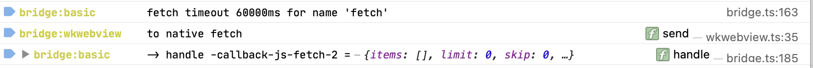

# 🌱 Zeed Library

> Plant the "zeed" of your next Typescript project and let it grow with this useful lib, providing basic functionalities handy in most projects.

- Strict TypeScript
- Covered by tests
- Universal for node.js and browsers
- No dependencies and lightweight
- Only modern ESM, no more CommonJS 
- Unified logging; various handlers
- Typed events

Get started like this:

```sh
npm i zeed
```

## Logging

Powerful logging.

```js
import { Logger } from 'zeed'

const log = Logger("app")

log("Debug")
log.info("Log this info")
```

By default, the most suitable log handlers are used, but it is also possible to set (`Logger.setHandlers([handlers])`) or add (`Logger.registerHandler(handler)`) new log handlers. You can choose from:

- `LoggerConsoleHandler(level)`: Plain basic output via `console` (default)
- `LoggerBrowserHandler(level)`: Colorful log entries
- `LoggerNodeHandler(path, level)`: Colorful logging for node.js
- `LoggerFileHandler(path, level)`: Write to file

Write custom ones e.g. for [breadcrumb tracking in Sentry.io](https://gist.github.com/holtwick/949d04151586cec529a671859ebbb650) or showing notifications to users on errors in a UI.

You can use `GlobalLogger` in submodules (for browsers) to make sure all logging goes through the same handlers, no matter what bundler is used. With `GlobalLogger.setLock(true)` any changes to handlers, factories and log levels can be suppressed, to ensure no conflicting settings with submodules. You should set up the Logging very early in your main project before loading submodules.

In the browser try calling `activateConsoleDebug()`, this will set only one logger which is closely bound to `console` with the nice effect, that source code references in the web console will point to the line where the log statement has been called. This is an example output on Safari:



Output can be filtered by setting `Logger.setFilter(filter)` following the well known [debug syntax](https://github.com/visionmedia/debug#wildcards). For the browser console you can also set like `localStorage = "*"` or for node console like `process.env.DEBUG = "*"` (or put a `DEBUG="*"` in front of the execution call).

Loggers can be extended. `const newLog = log.extend("demo")` will append `:demo` to the current namespace.

> Alternative logging solutions: [debug](https://github.com/visionmedia/debug) or [winston](https://github.com/winstonjs/winston) to name just a few.

## Promise / async / await utils

Wait for an event via `on` or `addEventListener`, useful in unit tests.

```js
await on(emitter, "action", 1000) // 1000 is optional timeout in ms
```

Wait for milliseconds.

```js
await sleep(1000) // wait 1s
```

Throw an error after timeout of 1 second.

```js
await timeout(asynFn, 1000)
```

If a value is not yet a Promise, wrap it to become one.

```js
await promisify(returnValue)
```

## Unique ID

Get a random unique ID of fixed length 26 (these are 16 bytes = 128 bit, encoded in Base32). According to [Nano ID Collision Calculator](https://zelark.github.io/nano-id-cc/): "~597 billion years needed, in order to have a 1% probability of at least one collision."

```js
const id = uuid()
```

Get an incremental unique ID for current process with named groups, great for debugging.

```js
uname("something") // => 'something-0'
uname("other") // => 'other-0'
uname("something") // => 'something-1'
```

Sortable unique ID inspired by [go-uuid](https://github.com/rsms/go-uuid). 6 bytes encode time and 10 bytes are random. String is Base62 encoded. Date can be extracted from the ID.

```js
const shortSortableId = suid() // = '000iMi10bt6YK8buKlYPsd'
suidDate(shortSortableId) // = 2021-07-03T22:42:40.727Z
shortSortableId < suid() // = true
```

## Typed event emitter

Typed and async emitter:

```ts
interface MyEvents {
  inc: async (count: number) => void
}

let counter = 0

const e = new Emitter<MyEvents>
e.on('inc', async (count) => counter + count)
await e.emit('inc', 1) // counter === 1
```

## CRDT compatible sorting

A conflict free sorting algorithm with minimal data changes. Just extend an object from `SortableItem`, which will provide an additional property of type number called `sort_weight`.

```ts
interface Row extends SortedItem {
  id: string
  title: string
}

let rows: Row[] = []

const getSortedRows = () => sortedItems(rows)
```

Use `startSortWeight`, `endSortWeight` and `moveSortWeight` to get initial values for new entries or manipulate existing ones.

> Essays:
>
> - [Holtwick: Smart Reordering for UITableView](https://holtwick.de/en/blog/smart-table-reordering)
> - [Figma: Fractional Indexing](https://www.figma.com/blog/realtime-editing-of-ordered-sequences/#fractional-indexing)
>
> The implementation in Zeed is pretty straight forward, but there are also more sophisticated approaches available as alternatives:
>
> - [Implementing Fractional Indexing](https://observablehq.com/@dgreensp/implementing-fractional-indexing)
> - [fractional-indexing](https://github.com/rocicorp/fractional-indexing) - npm module

## Custom binary data encoding / decoding

Integration of the [base-x](https://github.com/cryptocoinjs/base-x) code to support encoding and decoding to any alphabet, but especially base2, base16 (hex), base32, base62, base64.
Human-readable yet efficient encoding of binary data.

```js
const sample = new UInt8Array([1, 2, 3])
const { encode, decode } = useBase(62)
decode(encode(sample)) === sample // = true
```

## Deeply nested object utils

Handle complex objects.

```js
deepEqual({ a: { b: 1 } }, { a: { b: 2 } }) // false
deepMerge({ a: { b: 1 } }, { c: 3, a: { d: 4 } }) // {a:{b:1, d:4}, c:4}
```

---

Additional notes for development: [NOTES.md](NOTES.md).
