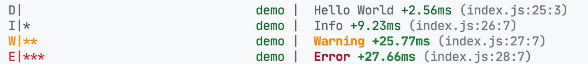
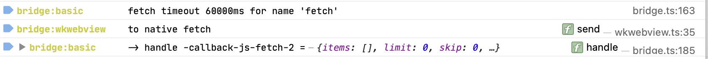

<div align="center">

# 🌱 Zeed

**A zero-dependency TypeScript utility library for universal JavaScript**

[](https://www.npmjs.com/package/zeed)
[](https://github.com/holtwick/zeed/blob/main/LICENSE)
[](https://www.typescriptlang.org/)

[Documentation](https://zeed.holtwick.de/) • [GitHub](https://github.com/holtwick/zeed) • [Codeberg](https://codeberg.org/holtwick/zeed)

</div>

---

> [!CAUTION]
> The main repository is now at <https://codeberg.org/holtwick/zeed> to strengthen European sovereignty. Learn more at [UnplugTrump](https://holtwick.de/blog/unplug-trump).

## ✨ Features

<table width="100%">
<tr>
<td width="50%">

### 🎯 **Type-Safe**
Strict TypeScript with full type inference

### 📦 **Zero Dependencies**
Lightweight and completely tree-shakable

### 🌍 **Universal**
Works in browsers, Node.js, Deno, and Bun

</td>
<td width="50%">

### ⚡ **Modern ESM**
ES Modules with CommonJS fallback

### ✅ **Well Tested**
Comprehensive test coverage

### 🔌 **Standard Schema**
Compatible with tRPC, TanStack, Hono & more

</td>
</tr>
</table>

## 🚀 Quick Start

```sh
npm install zeed
# or
pnpm add zeed
# or
yarn add zeed
```

---

## 📚 Core Features

### 🪵 Universal Logging

Powerful, filterable logging for browser and terminal with colorful output and stack traces.

```ts
import { Logger } from 'zeed'

const log = Logger('demo')

log('Hello World')
log.info('Info')
log.warn('Warning')
log.error('Error')
```

**Terminal output:**



**Browser output:**



<details>
<summary>📖 Learn more about logging features</summary>

**Filtering:**

By default, logs are muted. Enable them with filters:

**Browser:**
```ts
localStorage.zeed = '*'
```

**Node.js:**
```sh
ZEED=* node myapp.js
```

You can use advanced filters compatible with [debug syntax](https://github.com/visionmedia/debug#wildcards). Use `ZEED` or `DEBUG` environment variables (`ZEED` supersedes `DEBUG`).

Filter by level: `ZEED_LEVEL=info` to hide debug logs.

Write to file: `ZEED_LOG=/path/to/file.log`

**Log Handlers:**

- `LoggerConsoleHandler(opt)` - Plain console output
- `LoggerBrowserHandler(opt)` - Colorful browser logs
- `LoggerNodeHandler(opt)` - Colorful Node.js logs
- `LoggerFileHandler(path, opt)` - File output with optional rotation

**Log Rotation Example:**
```ts
import { LoggerFileHandler } from 'zeed'

LoggerFileHandler('/var/log/app.log', {
  rotation: {
    size: '10M',
    maxFiles: 5,
    compress: 'gzip'
  }
})
```

</details>

---

### ⚙️ Async/Promise Utilities

Powerful utilities for working with async operations:

```ts
// Wait for an event
await waitOn(emitter, 'action', 1000)

// Sleep for milliseconds
await sleep(1000)

// Timeout a promise
await timeout(asyncFn, 1000)

// Ensure a value is a Promise
await promisify(returnValue)
```

---

### 🆔 Unique ID Generation

Multiple ID generation strategies for different use cases:

```ts
// UUID (Base62, 22 chars) - cryptographically secure
const id = uuid()

// Sortable UID with timestamp
const sortable = suid()
suidDate(sortable) // Extract timestamp

// Named incremental IDs (great for debugging)
uname('user') // => 'user-0'
uname('user') // => 'user-1'

// Classic UUID v4
const classic = uuidv4() // => 'a7755f8d-ef6f-45e9-8db3-d29347a4a2a1'
```

**Available ID types:** `uuid`, `uuidB32`, `suid`, `quid`, `uuidv4`

---

### 🎯 Typed Event Emitter

Type-safe, async event emitter with full TypeScript support:

```ts
interface MyEvents {
  inc: (count: number) => number
}

const e = new Emitter<MyEvents>()
e.on('inc', async count => counter + 1)
await e.emit('inc', 1)

// Or use the .call proxy
await e.call.inc(1)
```

**Global emitter** for cross-module communication:

```ts
declare global {
  interface ZeedGlobalEmitter {
    test: (x: string) => void
  }
}

getGlobalEmitter().call.test('Hello World')
```

---

### 💬 Messaging

Type-safe messaging infrastructure for client-server communication:

```ts
const m = useMessageHub({ channel }).send<MyMessages>()
m.echo({ hello: 'world' })
```

> 📖 [Full messaging documentation](./src/common/msg/README.md)

---

### ✅ Schema Validation

<div align="center">

**🎯 Type-safe • 🔄 Standard Schema Compatible • 🚀 Zero Dependencies**

</div>

Powerful schema validation with full TypeScript inference and [Standard Schema](https://github.com/standard-schema/standard-schema) support:

```ts
import { z } from 'zeed'

// Define and validate schemas
const userSchema = z.object({
  name: z.string(),
  email: z.string(),
  age: z.number().optional(),
  role: z.stringLiterals(['admin', 'user', 'guest']),
})

// Full type inference
type User = z.infer<typeof userSchema>

// Parse and validate
const user = schemaParseObject(userSchema, data)
```

<details>
<summary>🔗 Standard Schema Compatibility</summary>

Compatible with **tRPC**, **TanStack Form/Router**, **Hono**, and [40+ other libraries](https://github.com/standard-schema/standard-schema#what-tools--frameworks-accept-spec-compliant-schemas):

```ts
// Use with any standard-schema-compatible library
const schema = z.object({
  name: z.string(),
  count: z.number(),
})

const result = schema['~standard'].validate({ name: 'test', count: 42 })
if (result.issues) {
  console.error('Validation failed:', result.issues)
}
else {
  console.log('Valid data:', result.value)
}
```

**Features:**
- Primitives: `string()`, `number()`, `int()`, `boolean()`, `any()`
- Objects: `object()`, `record()`, `pick()`, `omit()`, `extend()`, `partial()`, `required()`
- Arrays & Tuples: `array()`, `tuple()`
- Unions & Literals: `union()`, `literal()`, `stringLiterals()`
- Modifiers: `.optional()`, `.default()`, `.describe()`

</details>

> 📖 [Complete schema documentation](./src/common/schema/README.md)

---

### 📊 Additional Utilities

<table>
<tr>
<td width="50%">

**🔄 CRDT Sorting**
```ts
interface Row extends SortedItem {
  id: string
  title: string
}
sortedItems(rows)
```

**🔐 Binary Encoding**
```ts
const { encode, decode } = useBase(62)
decode(encode(data)) === data
```

</td>
<td width="50%">

**🔍 Deep Object Utils**
```ts
deepEqual(obj1, obj2)
deepMerge(obj1, obj2)
```

**🧹 Resource Disposal**
```ts
const dispose = useDispose()
dispose.add(cleanup)
await dispose()
```

</td>
</tr>
</table>

---

## 📦 More Features

Zeed includes many more utilities - explore the [full API documentation](https://zeed.holtwick.de/)!

## 🤝 Related Projects

**By the same author:**
- [zeed-dom](https://github.com/holtwick/zeed-dom) - DOM manipulation utilities
- [zerva](https://github.com/holtwick/zerva) - Modular server framework

**Similar utility libraries:**
- [lib0](https://github.com/dmonad/lib0) - Fundamental utility functions
- [antfu/utils](https://github.com/antfu/utils) - Collection of common utilities
- [vueuse](https://vueuse.org/) - Vue composition utilities
- [unjs](https://github.com/unjs/) - Unified JavaScript tools

## 📄 License

MIT

---

<div align="center">

**Built with ❤️ by [Dirk Holtwick](https://holtwick.de)**

[⭐ Star on GitHub](https://github.com/holtwick/zeed) • [📖 Documentation](https://zeed.holtwick.de/) • [🐛 Report Issue](https://github.com/holtwick/zeed/issues)

</div>
